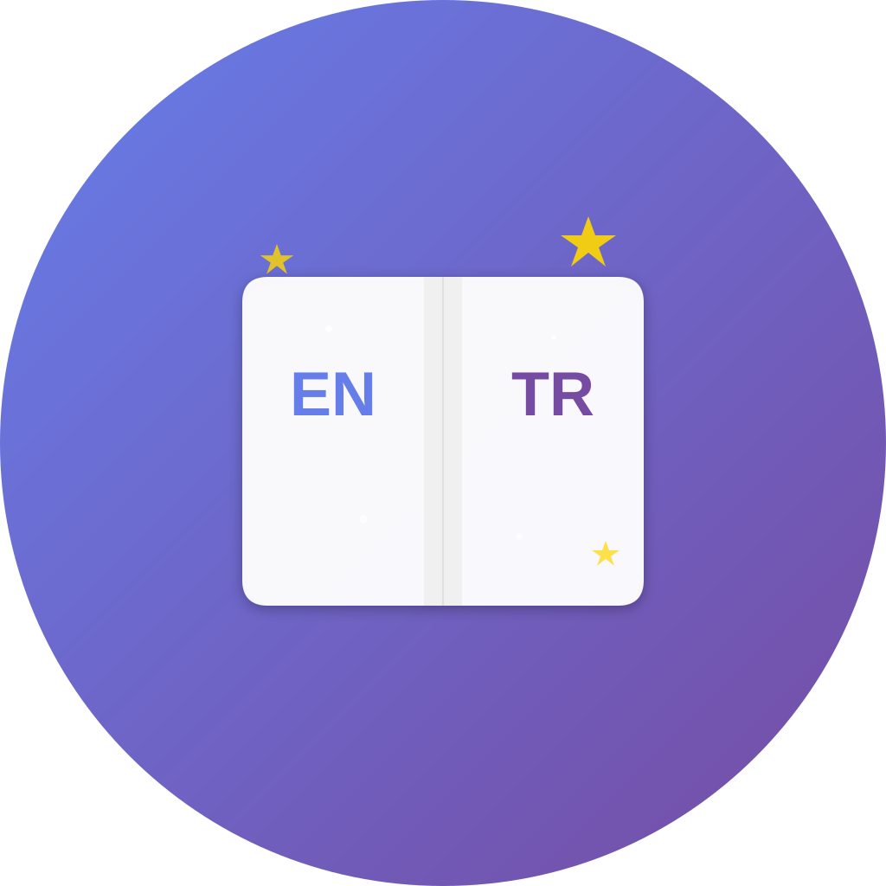
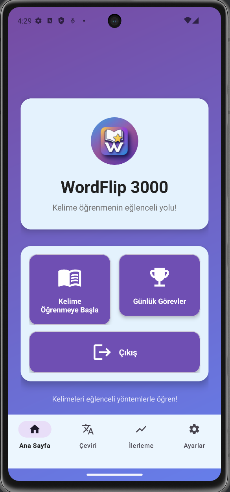
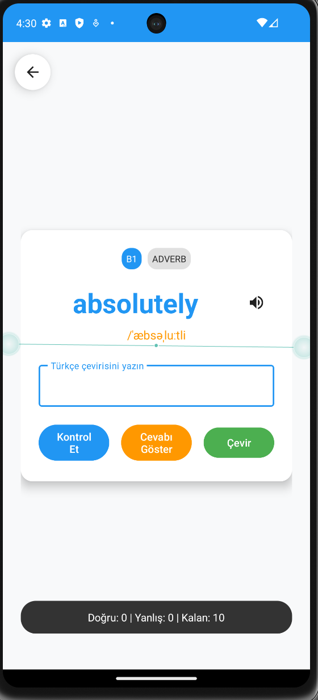
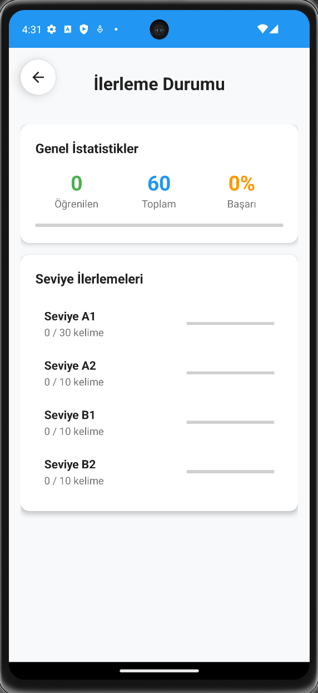
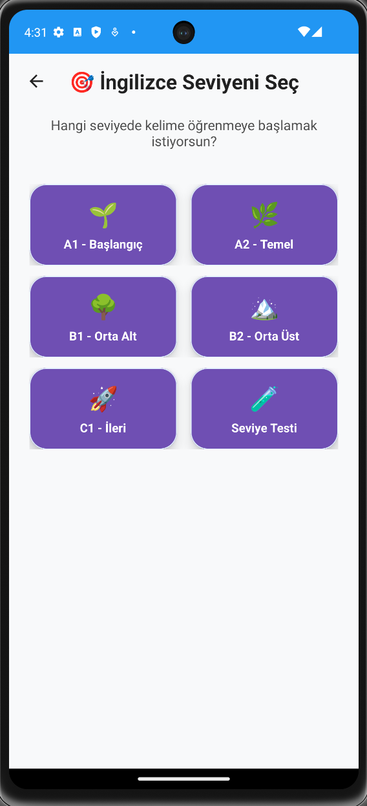
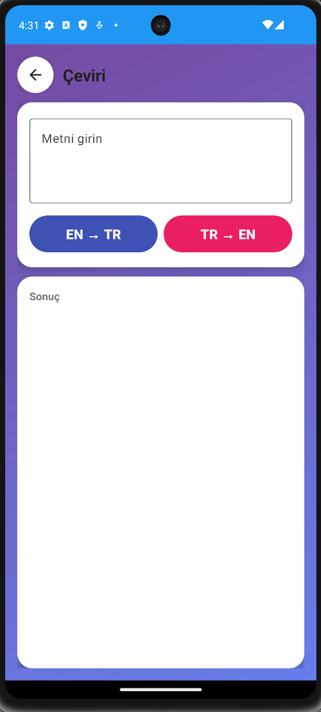

# 📚 WordFlip 3000 - İngilizce Kelime Öğrenme Uygulaması

<div align="center">
  
  
  **Eğlenceli ve etkili yöntemlerle İngilizce kelime öğrenin!**
  
  [](https://www.android.com/)
  [](https://kotlinlang.org/)
  [](https://developer.android.com/)
  [](LICENSE)
</div>

---

## 🎯 Özellikler

### 📚 Zengin İçerik
- **1000+ kelime** veritabanı
- **A1'den C1'e** 5 farklı seviye
- Kategorilere göre düzenlenmiş kelimeler
- Fonetik ve örnek cümleler

### 🧠 Akıllı Öğrenme Sistemi
- **Spaced Repetition (SM-2 Algoritması)** ile kalıcı öğrenme
- Adaptif tekrar sistemi
- Kişiselleştirilmiş öğrenme yolu
- İlerleme takibi ve istatistikler

### 🎮 Eğlenceli Öğrenme
- İnteraktif kelime kartları (Flashcards)
- Günlük görevler ve hedefler
- Çoktan seçmeli testler
- Seviye atlama sistemi

### 🎨 Modern Arayüz
- Material Design 3 uyumlu
- Koyu/Açık tema desteği
- Temiz ve minimal tasarım
- Türkçe ve İngilizce dil desteği

### 📱 Offline Çalışma
- İnternet bağlantısı **gerektirmez**
- Tüm özellikler offline kullanılabilir
- Google ML Kit ile offline çeviri

### 🔒 Gizlilik ve Güvenlik
- **Hiçbir kişisel veri toplanmaz**
- Reklam yok
- Tracker yok
- Tamamen ücretsiz

---

## 📱 Ekran Görüntüleri

<div align="center">
  
  
  
  
  
</div>

### Uygulama Özellikleri Görsel Olarak:

1. **Ana Menü** - Modern ve kullanıcı dostu arayüz
2. **Kelime Kartları** - İnteraktif öğrenme deneyimi
3. **İlerleme Takibi** - Detaylı istatistikler
4. **Seviye Sistemi** - A1'den C1'e 5 farklı seviye
5. **Çeviri** - Offline çeviri özelliği

---

## 🚀 Teknolojiler

### Android
- **Kotlin** - Ana programlama dili
- **Android SDK** - Minimum API 24 (Android 7.0)
- **Material Design 3** - Modern UI/UX

### Veritabanı
- **SQLite** - Yerel veri depolama
- Custom DAO pattern
- İlişkisel veritabanı yapısı

### Makine Öğrenmesi
- **Google ML Kit Translate** - Offline çeviri
- On-device model (internet gerektirmez)

### Algoritmalar
- **SM-2 (Spaced Repetition)** - Bilimsel aralıklı tekrar
- Adaptif öğrenme algoritması
- İlerleme takip sistemi

### Mimari
- **MVVM Pattern** - Temiz kod mimarisi
- Repository Pattern
- Singleton Pattern

---

## 📦 Kurulum

### Gereksinimler
- Android Studio Arctic Fox veya üzeri
- JDK 11 veya üzeri
- Android SDK 24+
- Gradle 7.0+

### Adımlar

1. **Repository'yi klonlayın**:
```bash
git clone https://github.com/[kullanici-adiniz]/wordflip3000.git
cd wordflip3000
```

2. **Android Studio'da açın**:
```
File → Open → wordflip3000 klasörünü seçin
```

3. **Gradle Sync**:
```
Android Studio otomatik sync yapacak
Veya: File → Sync Project with Gradle Files
```

4. **Çalıştırın**:
```
Run → Run 'app' (Shift+F10)
Veya: Yeşil play butonuna tıklayın
```

---

## 🏗️ Proje Yapısı

```
app/
├── src/
│   ├── main/
│   │   ├── java/com/example/learning/
│   │   │   ├── MainActivity.kt
│   │   │   ├── CardActivity.kt
│   │   │   ├── ProgressActivity.kt
│   │   │   ├── TranslateActivity.kt
│   │   │   ├── SettingsActivity.kt
│   │   │   ├── database/
│   │   │   │   ├── WordDao.kt
│   │   │   │   ├── GamificationDao.kt
│   │   │   │   └── QuestionDao.kt
│   │   │   ├── models/
│   │   │   │   ├── Word.kt
│   │   │   │   ├── Question.kt
│   │   │   │   └── UserProgress.kt
│   │   │   └── utils/
│   │   │       ├── DatabaseResetHelper.kt
│   │   │       └── SpacedRepetition.kt
│   │   ├── res/
│   │   │   ├── layout/
│   │   │   ├── drawable/
│   │   │   ├── values/
│   │   │   └── menu/
│   │   └── AndroidManifest.xml
│   └── build.gradle.kts
└── README.md
```

---

## 🎓 Nasıl Çalışır?

### Spaced Repetition (SM-2) Algoritması

WordFlip 3000, bilimsel olarak kanıtlanmış **SM-2 algoritmasını** kullanır:

1. **İlk Öğrenme**: Yeni kelimeyi görürsünüz
2. **Kısa Aralık**: 1 gün sonra tekrar
3. **Orta Aralık**: 3 gün sonra tekrar
4. **Uzun Aralık**: 7 gün sonra tekrar
5. **Kalıcı Hafıza**: 14+ gün sonra tekrar

Her doğru cevap aralığı uzatır, yanlış cevap sıfırlar.

### Kelime Öğrenme Süreci

```
1. Seviye Seçimi (A1-C1)
   ↓
2. Kelime Kartları
   ↓
3. Quiz/Test
   ↓
4. İlerleme Kaydı
   ↓
5. Spaced Repetition
   ↓
6. Seviye Atlama
```

---

## 🔧 Özelleştirme

### Tema Değiştirme

`values/themes.xml` içinde tema renklerini değiştirebilirsiniz:

```xml
<color name="primary">#667EEA</color>
<color name="secondary">#764BA2</color>
```

### Yeni Kelime Ekleme

`assets/` klasöründeki JSON dosyalarını düzenleyin:

```json
{
  "word": "wordflip",
  "translation": "örnek",
  "level": "A1",
  "category": "Daily"
}
```

---

## 📊 Veritabanı Şeması

### Words Tablosu
```sql
CREATE TABLE words (
  id INTEGER PRIMARY KEY,
  word TEXT NOT NULL,
  translation TEXT NOT NULL,
  level TEXT,
  category TEXT,
  review_count INTEGER DEFAULT 0,
  next_review_date INTEGER
);
```

### User Progress Tablosu
```sql
CREATE TABLE user_progress (
  id INTEGER PRIMARY KEY,
  level INTEGER DEFAULT 1,
  xp INTEGER DEFAULT 0,
  coins INTEGER DEFAULT 0,
  streak_days INTEGER DEFAULT 0
);
```

---

## 🤝 Katkıda Bulunma

Katkılarınızı bekliyoruz! Lütfen şu adımları izleyin:

1. **Fork edin** bu repository'yi
2. **Branch oluşturun**: `git checkout -b feature/yeni-ozellik`
3. **Commit yapın**: `git commit -m 'Yeni özellik eklendi'`
4. **Push edin**: `git push origin feature/yeni-ozellik`
5. **Pull Request açın**

---

## 📝 Lisans

Bu proje MIT lisansı altında lisanslanmıştır. Detaylar için [LICENSE](LICENSE) dosyasına bakın.

---

## 📞 İletişim

- **Geliştirici**: Muhammed Çakırgöz
- **E-posta**: muhammedcakirgoz00@gmail.com
- **GitHub**: https://github.com/Muhammedcakirgoz

---

## 🙏 Teşekkürler

- [Google ML Kit](https://developers.google.com/ml-kit) - Offline çeviri için
- [Material Design](https://material.io/) - UI/UX tasarımı için
- [SuperMemo](https://www.supermemo.com/) - SM-2 algoritması için

---

## 📈 Yol Haritası

### Mevcut Özellikler (v1.0)
- ✅ 1000+ kelime veritabanı
- ✅ Spaced Repetition (SM-2)
- ✅ Offline çalışma
- ✅ 5 seviye (A1-C1)
- ✅ Koyu/Açık tema

### Planlanan Özellikler (v2.0)
- [ ] Ödül sistemi (XP, coins, badges)
- [ ] Günlük görevler
- [ ] Sesli telaffuz
- [ ] Kelime oyunları
- [ ] Bulut yedekleme
- [ ] Sosyal özellikler

---

<div align="center">
  <p>⭐ Beğendiyseniz yıldız vermeyi unutmayın!</p>
  <p>Made with ❤️ in Turkey 🇹🇷</p>
</div>
